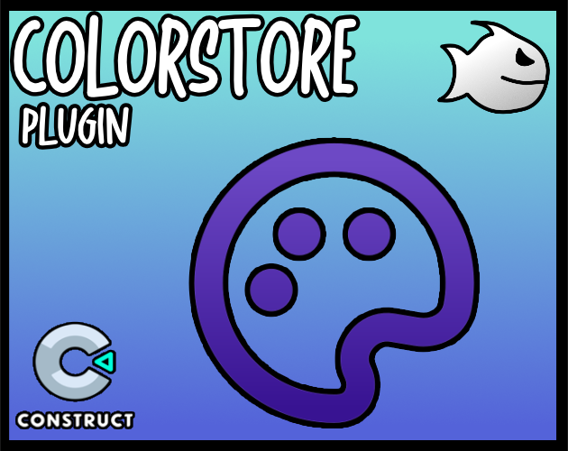

<br>
# Color Store
### Version 3.1.0.0

[](https://github.com/armandoalonso/color-store/releases/download/piranha305_colorstore-3.1.0.0.c3addon/piranha305_colorstore-3.1.0.0.c3addon)
<br>
<sub> [See all releases](https://github.com/armandoalonso/color-store/releases) </sub> <br>

---
A comprehensive Construct 3 plugin designed to store, manipulate, and seamlessly convert between various color formats, enhancing your project's color management capabilities. <br>
<b><u>Author:</u></b> piranha305 <br>
<b><u>Website:</u></b> https://piranha305.itch.io/ <br>
<sub>Made using [CAW](https://marketplace.visualstudio.com/items?itemName=skymen.caw) </sub><br>

## Table of Contents
- [Usage](#usage)
- [Examples Files](#examples-files)
- [Properties](#properties)
- [Actions](#actions)
- [Conditions](#conditions)
- [Expressions](#expressions)
---
## Usage
To build the addon, run the following commands:

```
npm i
npm run build
```

To run the dev server, run

```
npm i
npm run dev
```

## Examples Files
- [color-store-example](./examples/color-store-example.c3p)
</br>

</br>
</br>
- [color-store-indexed](./examples/color-store-indexed.c3p)
</br>
</br>
</br>

---
## Properties
| Property Name | Description | Type |
| --- | --- | --- |


---
## Actions
| Action | Description | Params
| --- | --- | --- |
| Set color (hex) | Sets the color | Tag             *(string)* <br>Color             *(string)* <br> |
| Set color (hsl) | Sets the color | Tag             *(string)* <br>Hue             *(number)* <br>Saturation             *(number)* <br>Lightness             *(number)* <br>Alpha             *(number)* <br> |
| Set color (packed) | Sets the color | Tag             *(string)* <br>Color             *(number)* <br> |
| Set color (rgb) | Sets the color | Tag             *(string)* <br>Red             *(number)* <br>Green             *(number)* <br>Blue             *(number)* <br>Alpha             *(number)* <br> |
| Set color (rgb normalized) | Sets the color | Tag             *(string)* <br>Red             *(number)* <br>Green             *(number)* <br>Blue             *(number)* <br>Alpha             *(number)* <br> |
| Clear color store | Clears the color store |  |
| Load colors from hex codes | Loads colors from hex codes | Hex Codes             *(string)* <br> |
| Load palette | Loads a palette | Palette             *(combo)* <br> |
| Load palette from file | Loads a palette from a file | File Name             *(projectfile)* <br> |
| Load palette from filename | Loads a palette from a string | Palette             *(string)* <br> |


---
## Conditions
| Condition | Description | Params
| --- | --- | --- |
| Current palette is | Checks if the current palette is the specified palette | Palette *(string)* <br> |


---
## Expressions
| Expression | Description | Return Type | Params
| --- | --- | --- | --- |
| HexToPacked | Converts Hex to Packed Color | number | Hex *(string)* <br> | 
| HexToRGB | Converts Hex to RGB String '(r,g,b,a)' | string | Hex *(string)* <br> | 
| RGBToHex | Converts RGB to Hex | string | Red *(number)* <br>Green *(number)* <br>Blue *(number)* <br>Alpha *(number)* <br> | 
| Alpha | Returns the color's alpha value | number | Tag *(string)* <br> | 
| AlphaIndexed | Returns the color's alpha value | number | Index *(number)* <br> | 
| Blue | Returns the color's blue value | number | Tag *(string)* <br> | 
| BlueIndexed | Returns the color's blue value | number | Index *(number)* <br> | 
| ColorCount | Returns the number of colors in the color store | number |  | 
| CurrentPalette | Returns the current palette | string |  | 
| GetColorJson | Returns the color's value as JSON | string | Tag *(string)* <br> | 
| GetColorJsonIndexed | Returns the color's value as JSON | string | Index *(number)* <br> | 
| GetColorStoreJSON | Returns the entire color store as JSON | string |  | 
| Green | Returns the color's green value | number | Tag *(string)* <br> | 
| GreenIndexed | Returns the color's green value | number | Index *(number)* <br> | 
| Hex | Returns the color as a hex string | string | Tag *(string)* <br> | 
| HexIndexed | Returns the color as a hex string | string | Index *(number)* <br> | 
| Hue | Returns the color's hue value | number | Tag *(string)* <br> | 
| HueIndexed | Returns the color's hue value | number | Index *(number)* <br> | 
| Lightness | Returns the color's lightness value | number | Tag *(string)* <br> | 
| LightnessIndexed | Returns the color's lightness value | number | Index *(number)* <br> | 
| NormalizedAlpha | Returns the color's alpha value (normalized) | number | Tag *(string)* <br> | 
| NormalizedAlphaIndexed | Returns the color's alpha value (normalized) | number | Index *(number)* <br> | 
| NormalizedBlue | Returns the color's blue value (normalized) | number | Tag *(string)* <br> | 
| NormalizedBlueIndexed | Returns the color's blue value (normalized) | number | Index *(number)* <br> | 
| NormalizedGreen | Returns the color's green value (normalized) | number | Tag *(string)* <br> | 
| NormalizedGreenIndexed | Returns the color's green value (normalized) | number | Index *(number)* <br> | 
| NormalizedREd | Returns the color's red value (normalized) | number | Tag *(string)* <br> | 
| NormalizedRedIndexed | Returns the color's red value (normalized) | number | Index *(number)* <br> | 
| Packed | Returns the color as a packed number | number | Tag *(string)* <br> | 
| PackedIndexed | Returns the color as a packed number | number | Index *(number)* <br> | 
| RandomColor | Returns a random color tag the color store | string |  | 
| Red | Returns the color's red value | number | Tag *(string)* <br> | 
| RedIndexed | Returns the color's red value | number | Index *(number)* <br> | 
| Saturation | Returns the color's saturation value | number | Tag *(string)* <br> | 
| SaturationIndexed | Returns the color's saturation value | number | Index *(number)* <br> | 
